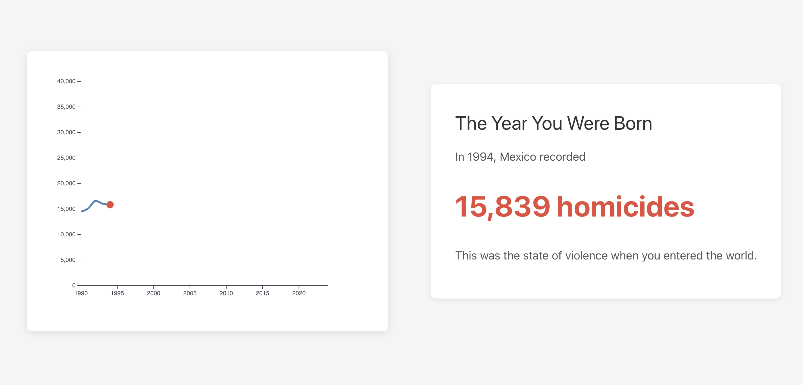
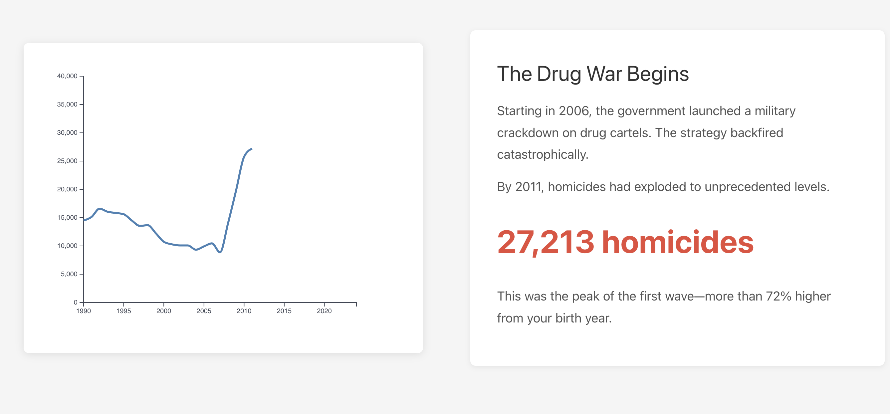
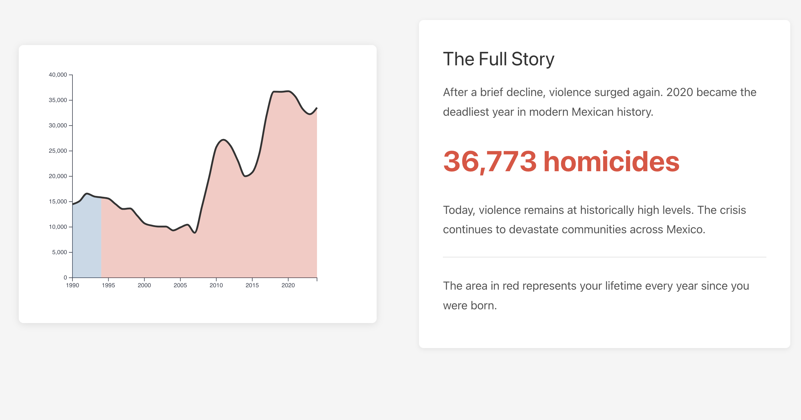
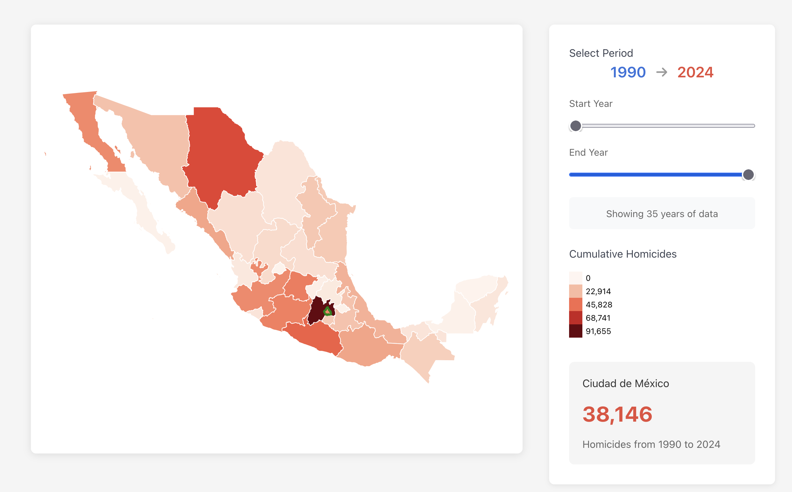
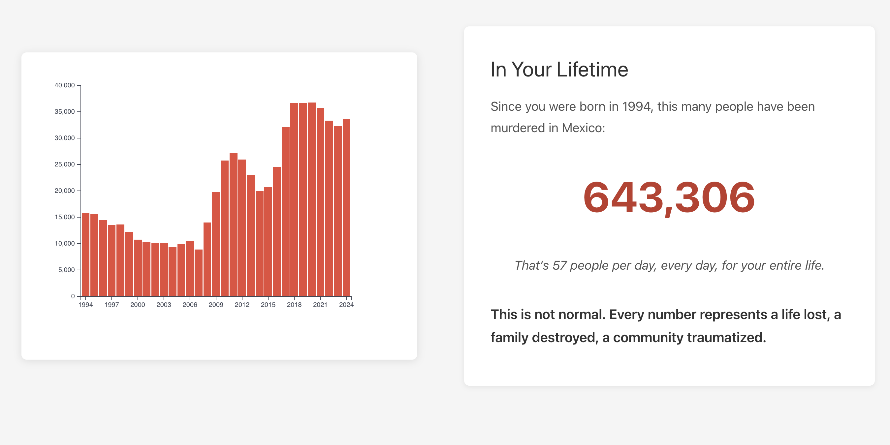
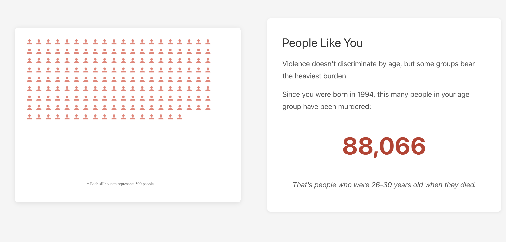

# How Much more Violent is Mexico since you were born?

Chema Galvez

## What is your current goal? Has it changed since the proposal?
My goal is to show Mexico's violenc though time. Create an impact on how thing have been evolving
and that people do not normalize what has been happening for almost two decades now.

I initially was planning on doing one big interactive followed by an article but now the idea is to make
most of the point visually with just small cards-like quick information that support the vizualizations

## Are there data challenges you are facing? Are you currently depending on mock data?
All data I'm using is final

## Describe each of the provided images with 2-3 sentences to give the context and how it relates to your goal.

* For all the graphs I simplified the axis and did not labeled them. I found both X and Y self explanatory but I'm open to that feedbak

Line Graph with the amount of homicdes that have occured in México sine 1990. The line only loads up to a pre-selected year the user puts as input (Year of birth):

Line Graph that loads upt to 2011, the peak of the first wave of violence in Mexico due to the War Against Narcotrafic

Area Chart showing the whole data (1990-2024). This graphs colors in red the cumulative years after the BirthYear of the user so they can see the whole evolution of violency quickly

Horizontal Bar Graph showing the top 5 more violent states of a given timeframe and State

Choropleth outlining the amount of homicides that have occured in México (cumulative) in a given timeframe

Historgram showing the amount of homicides in México for the whole data (1990-2024)

A scale symbol map. Here each person represents 500 people.

## What form do you envision your final narrative taking? (e.g. An article incorporating the images? A poster? An infographic?)

Hey James so... We have had much time that anticipated and also I did not went anywhere for Thanksgiving, so
I've been working already in my final form. My idea was to see how everything was beign shaped as I bult it, 
how the different elements interacted with each other, since this is a delicate
topic I wanted the feedback to be in all the narrative and how users felt
when interacting with the info/page/data as I believe all the card-like vizualisations can be think as just one big vizualisation. 
So I would appreciate if you could critique and give feedback on the index.html itself. i.e the graphs as shown there.

Everything is in the repository so you should be able to run it in your localholst.

...So this webpage idea of the final narrative. I understand that this milestone is asking for other things for the feedbakc
I would find useful is maybe something like if the graphs make sense with the narrative, if the current theme I choose is ok
or maybe changing colors, or maybe even you if think that the cards are a bad idea, maybe that the interactivity I chose
is not intuitivety or that you see some stuff that could be misinterpreted 